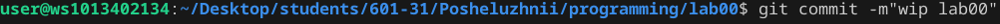

# programming
Prog labs
# отчет в Markdown 
## Задание 
Сложность:
    Rare

1.Создайте репозиторий для дисциплины на GitHub.

2.Склонируйте его себе на ПК.

3.Напишите свою первую программу.

4.Скомпилируйте и запустите её.

5.Получите по отдельности результаты каждого этапа 
компиляции.

6.Напишите отчёт в README.md. Отчёт должен содержать:

* Задание

    * Описание проделанной работы

    * Консольные команды

    * Скриншоты результатов

    * Ссылки на используемые материалы

7.Сделайте коммит и пуш.

8.Добавьте для себя в отчёт шпаргалку по работе с git.
## Ход работы

### 1.Создайте репозиторий для дисциплины на GitHub
Ссылка на репрозиторий: https://github.com/sosad234/programming
### 2.Склонируйте его себе на ПК.
```shell
git clone https://github.com/sosad234/programming.git
```


### 3.Напишите свою первую программу
```c

#include <stdio.h>
int main()
{
    printf("Hello, World!\n");
    return 0;
}
```
### 4.Скомпилируйте и запустите её

### 5.Получите по отдельности результаты каждого этапа компиляции
### Препроцессор

### Компилятор

### Объектные файлы 

### 7.Сделайте коммит и пуш 
 
 
### 8.Добавьте для себя в отчёт шпаргалку по работе с git. 
``` 
git add . 
git commit -m"wap lab00"
git push 
```
### Список используемых источников
* https://github.com/still-coding/report_demo/blob/main/README.md 
* https://doka.guide/tools/markdown/
