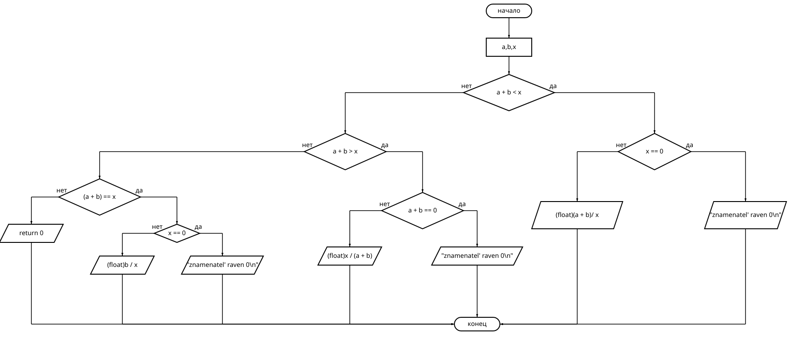
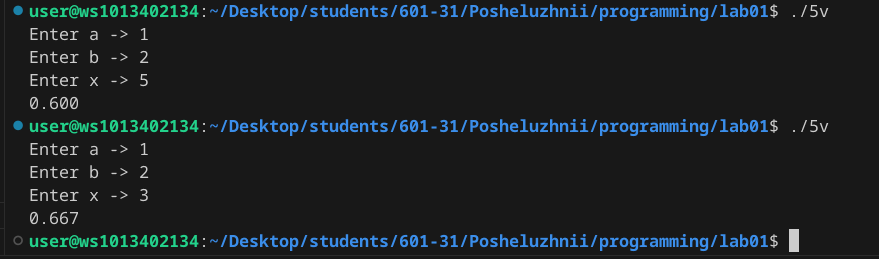

# Отчёт в Markdown
## Задание 
1. Разберите код программы из примера.

2. Составьте блок-схему алгоритма для своего варианта.

3. Напишите программу, решающую задачу по своему варианту.

### Используемые ссылки 
https://programforyou.ru/block-diagram-redactor