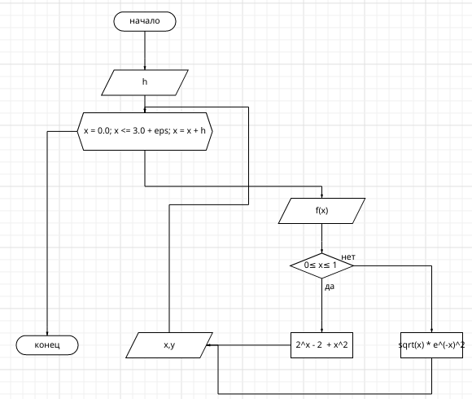

# programming
lab №2

# Отчет 
## Задание
Сложность:
  Rare
   
    1. Напишите программу по варианту, используя оператор цикла while (нечётные варианты) или do while (чётные варианты).
    2. Напишите программу, используя оператор цикла for.
    3. Постройте график с использованием gnuplot.
    4. Составьте блок-схемы.
    5. Оформите отчёт в README.md. Отчёт должен содержать:
        5.1 Задание
        5.2 Описание проделанной работы
        5.3 Скриншоты результатов
        5.4 Блок-схемы
        5.5 График функции
        5.6 Ссылки на используемые материалы

## Этапы работы
 ## Вариант - 5
 
 ### 1. Напишите программу по варианту, используя оператор цикла while (нечётные варианты) или do while (чётные варианты).
``` 
#include <stdio.h>
#include <math.h> 
#include <unistd.h>

int main()
{
    
    double x,h,res;
    x = 0.0;
    scanf("%lf", &h);
    int z;
    int k;
    k = 0;
    z = 3 / h + 1; 
    
    while(z > k)
    {
        if (x >= 0 && x <= 1.5)
            res =  pow(2,x) - 2 + pow(x, 2);
        if (x > 1.5 && x <= 3)
            res = sqrt(x) * exp(-x * x);
        printf("%lf %lf\n", x, res);
        x += h;
        k++;
    }
    return 0;
}
```
### 2. Напишите программу, используя оператор цикла for. 
```
#include <stdio.h>
#include <math.h>

int main()
{
   double x = 0.0, y;
   double eps;
   double h;
   scanf("%lf", &h);
   eps = h / 2.0;
   printf("x\t\ty\n");
   for(x = 0.0; x <= 3.0 + eps; x = x + h)
   {
       if(x <= 1.5 + eps)
         y = pow(2.0, x) - 2.0 + pow(x, 2);
       else
         y = sqrt(x) * exp(-pow(x, 2));
       printf("%f\t%f\n", x, y);
   }
   return 0;
}
``` 
### Таблица значений 

### 3. Постройте график с использованием gnuplot.
 
### 4. Составьте блок-схемы. 


### 5. Список используемых источников. 
https://habr.com/ru/companies/ruvds/articles/517450/
https://en.wikibooks.org/wiki/LaTeX/Mathematics 
