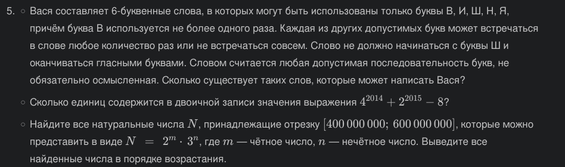

# PyProg

## Задание 
Сложность:
    Rare
        
        1. Напишите программу для решения задач своего варианта.
        2. Оформите отчёт в README.md. Отчёт должен содержать:
            2.1. Условия задач
            2.2. Описание проделанной работы
            2.3. Скриншоты результатов
            2.4. Ссылки на используемые материалы

## Отчет

## Этапы работы
### 1. Задание по Варианту №5



### 2. Код
```
# 1 ЗАДАНИЕ

import itertools

def A() : #  определяем функцию A(), которая будет считать количество допустимых слов
    S = ['В', 'И', 'Ш', 'Н', 'Я']
    L = ['И', 'Я']
    count = 0 # счетчик слов

    for i in itertools.product(S, repeat=6) : # 6-буквенные слова
        if i.count('В') <= 1 and i[0] != 'Ш' and i[4] not in L : # условие задачи
            count += 1 # счетчик слов

    return count # возвращение значения(количество слов)

word_count = A() # сохраняем результат в переменной
print("№1. КОЛИЧЕСТВО СЛОВ:", word_count)


# 2 ЗАДАНИЕ

print("№2. КОЛИЧЕСТВО ЕДИНИЦ:",bin(4**2014 + 2**2015 - 8).count('1'))

# 3 ЗАДАНИЕ

A = [] # Создается пустой список, в котором мы будем хранить все значения, удовлетворяющие условию

for m in range(0, 100, 2): #  перебирает четные значения от 0 до 100 (не включая 100) для переменной m
    for n in range(1, 101, 2): # перебирает нечетные значения от 1 до 101 (не включая 101) для переменной n
        B = 2**m * 3**n
        if 200000000 <= B <= 400000000:
            A.append(B) # сохраняется в переменной B

# Сортируем список по возрастанию
sorted_A = sorted(A)

# Мы перебираем все значения в отсортированном списке и выводим их по одному
for B in sorted_A:
    print(B)

```

### 3. Результаты


### 4. Список использованных источников 
1. https://www.youtube.com/watch?v=xIEVAm7BakE