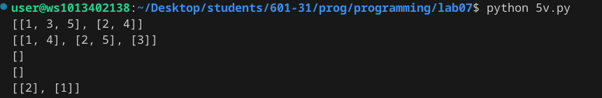
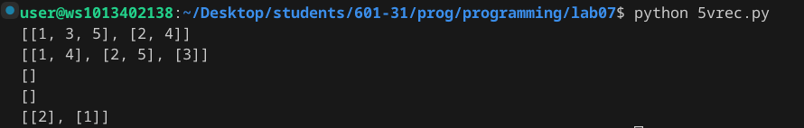
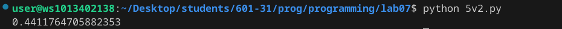
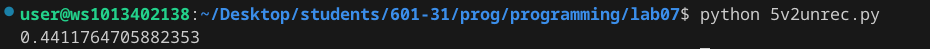

# lab 07

# Задание
    Сложность:
        Rare
            Напишите две функции для решения задач своего варианта - с использованием рекурсии и без.
            Оформите отчёт в README.md. Отчёт должен содержать:
            Условия задач
            Описание проделанной работы
            Скриншоты результатов
            Ссылки на используемые материалы

# Вариант №5


# Ход работы
# Программное решение 1
Без рекурсии
```python
python
lst = [1,2,3,4,5]

def split(lst, n):
    if len(lst) <= 1: # Проверяем, пуст ли список
        return []
    else:
        if len(lst) < n:  
            n = len(lst)
        return [lst[i::n] for i in range(n)]

print(split(lst, 2))
print(split(lst, 3))
print(split([], 2))
print(split([], 3))
print(split([2, 1], 4))
```
С рекурсией
```python
def split(lst, n):
    if len(lst) <= 1:  # Проверяем, пуст ли список или содержит только один элемент
        return []
    elif n > len(lst):  # Проверяем, можно ли дальше делить список
        return split(lst, len(lst))
    else:
        return [lst[i::n] for i in range(n)]

lst = [1, 2, 3, 4, 5]
print(split(lst, 2))
print(split(lst, 3))
print(split([], 2))
print(split([], 3))
print(split([2, 1], 4))
```

# Результат 1
без рекурсии

с рекурсией 

# Программное решение 2
без рекурсии
```python
def func(i):
    if i == 1 or i == 2:
        return 0
    elif i == 3:
        return 1.5
    else:
        prev1, prev2, prev3 = 0, 0, 1.5
        current = 0
        for j in range(4, i+1):
            current = (j+1)/((j*j)+1) * prev3 - prev2 * prev1
            prev1, prev2, prev3 = prev2, prev3, current
        return current

result = func(4)
print(result)
```
с рекурсией
```python
def func(i):
    if i == 1:
        print(0)
        return 0
    elif i == 2:
        print(0)
        return 0
    elif i == 3:
        print(1.5)
        return 1.5
    else:
        A = (i+1)/((i*i)+1) * func(i-1) - func(i-2) * func(i-3)
        print(A)
        return A

func(1)
```
# Результат 2 
с рекурсией

без рекурсии


# Список использованных источников
1. https://qna.habr.com/q/906791
