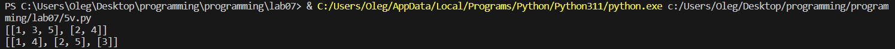
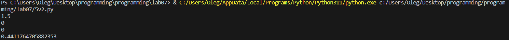

# lab 07

# Задание
    Сложность:
        Rare
            Напишите две функции для решения задач своего варианта - с использованием рекурсии и без.
            Оформите отчёт в README.md. Отчёт должен содержать:
            Условия задач
            Описание проделанной работы
            Скриншоты результатов
            Ссылки на используемые материалы

# Вариант №5


# Ход работы
# Программное решение 1
```python
lst = [1,2,3,4,5]

def split(lst, n):
    return [lst[i::n] for i in range(n)] # В каждой итерации создается подсписок, начиная с i-го элемента и берущего каждый n-ный элемент далее.

print(split(lst, 3))
```

# Результат 1



# Программное решение 2
```python
def func(i):
    if i == 1:
        print(0)
        return 0
    elif i == 2:
        print(0)
        return 0
    elif i == 3:
        print(1.5)
        return 1.5
    else:
        A = (i+1)/((i*i)+1) * func(i-1) - func(i-2) * func(i-3)
        print(A)
        return A

func(1)
```
# Результат 2 



# Список использованных источников
1. https://qna.habr.com/q/906791