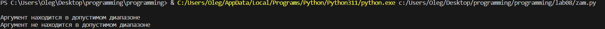

# Лабораторная №8

## Задание

Сложность: Rare

    1. Решите обе задачи своего варианта.
        2. Примените декоратор к замыканию.
        3. Оформите отчёт в README.md. Отчёт должен содержать:
            Условия задач
            Описание проделанной работы
            Скриншоты результатов
            Ссылки на используемые материалы

## Вариант 5


## Ход работы

### Программа 1

```python
def func(min, max):
    def B(value):
        if min <= value <= max:
            print("Аргумент находится в допустимом диапазоне")
        else:
            print("Аргумент не находится в допустимом диапазоне")
    
    return B

B = func(0, 10)
B(5)  # Аргумент находится в допустимом диапазоне
B(15)  # Аргумент не находится в допустимом диапазоне
```

### Результат 1



### Программа 2

```python
def A(func):
    def wrapper(*args, **kwargs): # внутри этой функции оборачиваем вызов исходной функции func в блок try-except
        try:
            return func(*args, **kwargs)
        except Exception as e:  # можно указать конкретные типы исключений
            print(f"Произошла ошибка: {e}")
  
    return wrapper

@A
def divide(a, b):
    result = a / b
    print(f"Результат деления: {result}")

divide(10, 2)  # Результат деления: 5.0
divide(10, 0)  # Произошла ошибка: division by zero
```

### Результат 2


### Список использованных источников

1. [Замыкание](https://ru.hexlet.io/courses/python-functions/lessons/closures/theory_unit)
2. [Декоратор](https://ru.hexlet.io/courses/python-functions/lessons/decorators/theory_unit)
