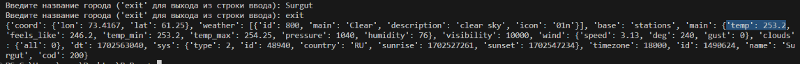

## Задание

    Сложность:   Rare

    1. Решите задачу своего варианта.

    2. Оформите отчёт в README.md. Отчёт должен содержать:

    Условия задач

    Описание проделанной работы

    Скриншоты результатов

    Ссылки на используемые материалы

## Вариант №5


## Код

```python

import requests


defweather_generator(cities, api_key):

    base_url = "http://api.openweathermap.org/data/2.5/weather"# сайт с погодой

    for city in cities:

        response = requests.get(base_url, params={"q": city, "appid": api_key})

        data = response.json()

        yield data


# Использование генератора

api_key = "5b35fa97ec38d7d5b13eebb6ea3faf98"  # Здесь API ключ

cities = []

whileTrue:

    city = input("Введите название города ('exit' для выхода из строки ввода): ")

    if city.lower() == 'exit':

        break

    cities.append(city)


for weather_data in weather_generator(cities, api_key):

    print(weather_data)

```

## Результаты



## Объяснение

Для получения данных о погоде я пользовался таким сайтом как [OpenWeather](https://openweathermap.org/). Данный код представляет собой функцию weather_generator, которая использует генератор для получения данных о погоде для заданных городов.

Первоначально, я импортировал библиотеку requests, которая позволяет отправлять HTTP-запросы. Затем определяется функция weather_generator, которая принимает два параметра: список городов (cities) и API ключ (api_key).

Внутри функции определен base_url, который представляет собой базовый URL-адрес API сервиса OpenWeatherMap. Затем мы проходимся по каждому городу в списке cities и выполняем GET-запрос к API, передавая параметры q (название города) и appid (API ключ).

Ответ получаем в формате JSON с помощью метода .json() и используем оператор yield, чтобы возвращать данные о погоде по одному городу при каждой итерации цикла. Генератор позволяет получить данные по мере необходимости, без загрузки и обработки всех данных сразу.

В основной части кода определяются переменные api_key и cities. Здесь запускаем бесконечный цикл while, в которой просят пользователя ввести названия городов. Если пользователь вводит 'exit', цикл прерывается, и выводятся полученные данные о погоде для каждого города с помощью цикла for.

Таким образом, код позволяет получать данные о погоде с помощью генератора для заданных городов, используя API сервиса OpenWeatherMap.

Погода выводится в кельвинах. Я не придумал как сделать в градусах Цельсия, поэтому просто вычитайте 273.

Кстати вот такая погода сейчас в Сургуте(для сравнения с выводом в терминале).


## Список использованных источников

1. [Задумка с погодой](https://habr.com/ru/articles/315264/)
2. [Генераторы](https://habr.com/ru/articles/560300/)
